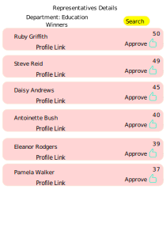
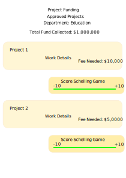

* **Project Name:** Shivarthu
* **Team Name:** Reaudito
* **Payment Address:** 0x7e30FB962f951ef78D901865F87DD036fc5aa946 (DAI)


### Overview

Shivarthu: The blockchain-based decentralized governance system. Democracy is about fair and equal treatment of everyone in a country. But it becomes unrealistic to achieve when political parties have their conflict of interest, and leaders don’t have the expertise to make evidence-based policies and neither have the skill and manpower for solving problems that surround our society and ecosystem. The new fair democracy provides an elegant way of governance that separates the representative responsibility according to their specialization and can grow into any complexity. The governance is divided into various departments, and each department is supervised by representatives with expertise in the field. Rational voters who have a sufficient understanding of the departments and their issues will be given more weight in the voting process than other voters. It results in a self-reinforcing feedback loop that eliminates frivolous actors and leaves utilitarian ones in charge.

https://shivarthu.reaudito.com/paper/Shivarthu_whitepaper.pdf 

Shivarthu will be build on Substrate.

Our democracy has many challenges, blockchain can provide a way to tackle those challenges by minimizing trust through game theory.  That made our team interested in creating this project.


### Project Details

Project Github link: https://github.com/amiyatulu/shivarthu


#### Departments:
The governance is divided into many departments like education, infrastructure, health, community service for every locality.
#### Expertise evaluation of representatives :
Voters and especially representatives need to have some experience or expertise in the department. Experience is required because education about the department leads to better decision making. 
Their kyc and experience is evaluated by schelling game.

#### Vouching
A family tree is constructed.
If they know each other, friends and relatives will become guarantors for each other.
Moderators chosen through approval voting have the ability to invalidate the fake vouching by down voting the guarantor.


Experience evaluation pallet:  
https://github.com/amiyatulu/shivarthu/tree/main/pallets/template  


 

#### Schelling Game:

[Schelling Game Effectiveness](./effectiveness_schelling_game.md)


In this project, the Schelling game is employed to perform Know Your Customer (KYC) checks on users. Furthermore, a modified version of the Schelling game called the score Schelling game is applied to funding departments, incorporating both funding allocation and rating of users based on the positive externality they generate.

In the Schelling game, individuals who wish to participate as jurors can apply to make decisions. The likelihood of being selected as a juror is directly proportional to the number of tokens a juror stakes. The more tokens a juror stakes, the greater their chances of being chosen. Additionally, jurors are randomly selected, which helps safeguard the system against sybil attacks.

We will use the substrate randomness trait for generating a random number.
https://docs.substrate.io/reference/how-to-guides/pallet-design/incorporate-randomness/

Then jurors will vote for their decision using the commit and reveal scheme. In the commit phase, they submit the hash of the vote string. Then, in the reveal phase, they submit the hash and the vote string. If the vote string matches with the hash, then the vote is accepted. 
If a juror's vote is coherent (more than 51% of other jurors agree) then they receive incentives, otherwise, incentives are deducted from the stake of the juror. 

Sortition Sum Game pallets:
https://github.com/amiyatulu/shivarthu/tree/main/pallets/sortition-sum-game


#### Voting for selection of department representatives:

The election will be conducted using a multi-winner approval system. To choose the representatives, we will employ the sequential Phragmén method on the substrate. In this approach, instead of using stake, we will consider the vote weight based on factors such as reputation, experience, and positive externality scores. These scores are determined by the level of participation in the network or the positive external effects they have generated. As mentioned earlier, the positive externality score is calculated using the score Schelling game.

https://paritytech.github.io/substrate/master/sp_npos_elections/phragmen/fn.seq_phragmen.html

Approval Voting:   
   
Winners:   


Seq phragmen voting:
https://github.com/amiyatulu/shivarthu/tree/main/pallets/election


#### Voting for selection of governors   
Governers will be selected again by seq phragmen, to form a fully decentralized governance they will have functions of setting different thresholds, like election timing, the number of elected representatives, and approving departments that can be formed.


#### Project application and acceptance:
The representatives are in charge of accepting the incoming projects for funding. 
People will submit their problems, for example, waterlogging in the locality.
Then experts all around the globe will submit the solution. The solution will be peer-reviewed to check its pros, cons, and suggest improvements that can be made. The review must meet the scientific guidelines. The solution can undergo revision through peer review feedback.
The solution provider and peer reviewer have to stake some money to receive incentives for their work. The solution and peer review will again be approved and disapproved through the shelling game after checking whether the content meets the quality as recommended in scientific guidelines. The solutions provider and reviewer will get the incentives if it gets approved, otherwise, some money will be cut from the stake. It creates pressure on the reviewer to maintain quality without noise.   
   

The representatives of the department will select the most optimal solution.
After that persons wanting to take the lead to implement the solution will apply. Again representatives will select the best project leader from the application.   
  
      


## Money for department:   

Form a department with a location with some min members, say 3000, and get it approved by the main governance.    

### Department price discovery:   

Say we have 1,000,000 departments with 3000 population each.    

Mega department with 1,000,000 population, will get 300x more weightage funding.   

With score schelling game, we will get score between 0-10  
Score schelling game: 0-10 scores  
10 means 100% funding  
1 means 10% funding  
0 means no funding  

ax+ 0.1bx + 0.2cx + 0.3dx + ..... + 0.9jx = Total fund   

100% funding = x    
0.1 when you get 1 score, 0.3 when you get 3 score etc.   
a, b, c, etc. are a number of departments with particular scores. 

You have the option to assign a rating to the department on a scale of 0 to 5 or 0 to 10, without any knowledge of what ratings others are giving. If the "mean" rating of all the jurors closely matches your rating, you will receive incentives as a juror. However, if the "mean" rating deviates significantly from your assigned rating, your incentives will be deducted. Consequently, jurors will strive to align their ratings with what others are likely to assign based on the available information, rather than arbitrarily defecting from the consensus.

## Price discovery of projects through Score Schelling Game:

1) When you submit a project, you need to provide details of the funding needed for work to be done.
2) Then, we will have a percentage Schelling game to predict the price. That is, you can predict whether to increase or decrease the funding amount in percentage. Score values will remain from -10 to +10, -10 means 100% decrease, +10 means 100% increase
The range of -10 to +10 has a problem because the mean works best without extreme values. So, if someone gives -10, and others give 1, the mean result can get screwed due to the -10 outlier. So the trick is to remove outliers by computing the standard deviation. Remove all values more than one standard deviation away from the mean. Then, we calculate the new mean of the left values (it consists of 68.27% data of the set).


Code to calculate new mean:

```python
import statistics


def calculate_new_mean(items):
    mean = statistics.mean(items)
    print(mean)
    sd = statistics.stdev(items) 
    print(sd)


    #The values less than one standard deviation away from the mean account for 68.27% of the set
    #So we calculate mean of this 68.27% of data removing outlier

    # New data
    new_items = []
    for x in items:
        if x >= mean - sd and x <= mean + sd:
            new_items.append(x)

    print(new_items)

    new_mean = statistics.mean(new_items)
    print(new_mean)
    print("********************")

items = [-10, 1, 1, 1, 5, 1, 1, 7]
calculate_new_mean(items)
# 0.875
# 4.969550137731641
# [1, 1, 1, 5, 1, 1]
# 1.6666666666666667
# ********************
items2 = [-10, -10, 0, 0, 0, 0, 0, 1, 0, 0, 0, 0]
calculate_new_mean(items2)
# -1.5833333333333333
# 3.941811612428832
# [0, 0, 0, 0, 0, 1, 0, 0, 0, 0]
# 0.1
# ********************
items3 = [-10, -10, 0, 0, 0, 0, 0, 1, 0, 0, 0, 0, -9, -8, -7, -6, -5, -4, -3, -2, -1]
calculate_new_mean(items3)
# -3.0476190476190474
# 3.8141341150540375
# [0, 0, 0, 0, 0, 0, 0, 0, 0, -6, -5, -4, -3, -2, -1]
# -1.4
# ********************
```
  


3) Then, we will do quality score voting Schelling game that checks the project meets the quality guidelines. The score range is 0-5
4) The amount of funding will be directly proportional to (Predicted Price) * (Quality Score/5*2)
Code:
```python
total_fund = 200000


predictprice = [(17411)*(5/5*2), (411)*(5/5*2), (17411)*(5/5*2), (1741)*(2/5*2)]

total_predictprices = 0
for x in predictprice:
    total_predictprices = total_predictprices + x

predicted_price_percentage = []
for x in predictprice:
    percentage = x / total_predictprices * 100
    predicted_price_percentage.append(percentage)


money_distribution = []
for x in predicted_price_percentage:
    money = x * total_fund/100
    money_distribution.append(money)


print(money_distribution)
```

The algorithm tries to meet the values of teal organization through reduced compensation inequality.


### Randomized Tax collection

Initial project funding comes from inflation, however as the inflation rate declines over time, the funds are collected by subtracting some amount of balance from different accounts so that there is no longer any inflation.

To avoid creating disincentives to invest in the coin, tax collection or deduction of balance is randomized for every transaction.

During a transaction, a random value is generated between 0 and 10. If the drawn number is 0, no tax will be deducted. If the number is 10, a 5% tax will be deducted from the transaction. In the case of the drawn number being 5, a 2.5% tax will be deducted.

In order to stop hoarding following tax collection can also be applied:

An account number is assigned to each account starting from 1000 in ascending order. A random number n between 1-1000 is drawn.

All account numbers with account_number % 1000 == drawn random number are taxed

If the drawn number is 1,000, one out of every 1,000 accounts will be taxed.

The primary governance determines the tax rate. The block number is stored during the draw. One draw is conducted each month at random time. Tax is deducted when the account interacts with the blockchain.


### Ecosystem Fit


The project will be built on the substrate as a parachain or parathread. 

Other projects similar to it is gitcoin, but its not in Substrate / Polkadot / Kusama ecosystem. Gitcoin uses quadratic funding, but we will use score schelling game for allocation of funds. Gitcoin is for mainly blockchain projects, but our projects includes local community problems. 

### References 
Schelling game whitepaper of Kleros:    
https://kleros.io/whitepaper.pdf  
Approval Voting:  
https://electionscience.org/   

## Team:

### Team members

* Amiya Behera (Developer)
* Soumya Ranjan Behera (Developer)
* Mahesh Sahoo (Advisor)

### Contact

* **Contact Name:**  Amiya Behera
* **Contact Email:** amiyatulu@gmail.com
* **Website:** https://shivarthu.reaudito.com/#/

### Legal Structure

* **Registered Address:** Charampa, Bhadrak, Odisha, India
* **Registered Legal Entity:** Reaudito

### Team's experience

Amiya Behera is a full-stack developer and has build many webapps and a few dapps. Has experience in substrate, rust, reactjs, python and also in building mobile apps in react native. 
Soumya Ranjan Behera is also a full stack developer with experience in reactjs, react native and python.


### Team Code Repos

* https://github.com/amiyatulu
* https://github.com/soumyababu
* https://github.com/amiyatulu/shivarthu


## Development Roadmap :


| Number | Deliverable | Specification |
| -----: | ----------- | ------------- |
| 0a. | License |  MIT  |
| 0b. | Documentation | We will provide both **inline documentation** of the code and a basic **tutorial** that explains how a user about the project |
| 0c. | Testing Guide | Core functions will be fully covered by unit tests to ensure functionality and robustness. In the guide, we will describe how to run these tests. |
| 0d. | Docker | We will provide a Dockerfile(s) that can be used to test all the functionality delivered with this milestone. |
| 0e. | Article | We will publish an **article**/workshop that explains our project (what was done/achieved as part of the grant.) |
| 1. | Substrate module: Experience Evaluation | Schelling game for experience evaluation |
| 2. | Substrate Module: Approval voting| Selection of representatives through multi winner approval |
|3.| Reactjs UI for Experience Evaluation| Uploading evidence of experience for the department using IPFS, UI for commit and reveal voting for schelling game and interaction of UI with substrate |
|4.| Reactjs Approval Voting UI| Userfriendly UI for voting the representatives where their profile is shown |


### Milestone 2 — Additional features


| Number | Deliverable | Specification |
| -----: | ----------- | ------------- |
| 0a. | License |  MIT  |
| 0b. | Documentation | We will provide both **inline documentation** of the code and a basic **tutorial** that explains how a user about the project |
| 0c. | Testing Guide | Core functions will be fully covered by unit tests to ensure functionality and robustness. In the guide, we will describe how to run these tests. |
| 0d. | Docker | We will provide a Dockerfile(s) that can be used to test all the functionality delivered with this milestone. |
| 0e. | Article | We will publish an **article**/workshop that explains our project (what was done/achieved as part of the grant.) |
| 1. | Substrate module: Peer review system | Reviewing the projects using schelling game | 
| 2. | Substrate module: Fund allocation | Allocating the fund using score schelling game | 
| 3.| Reactjs UI for peer review system and Fund allocation | User friendly UI for reviewing the projects, schelling game voting interface, and fund allocation |
| 4. | Search Engine| Offchain search engine for project discovery and finding representatives |


## Future Plans

Short-term:
 Improve the ideas with discussing with community   
 Increase social media reach   
 Write the source code   
 
Long-term:  
    Onboard people into the app, and improve it taking feedback from the community.  
    Enhance the app, provide upgrades when required.    


